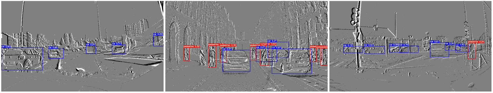

# CSNet
Contronym Spiking Neural Networks for event-based object detection

from the Gen1 dataset to 1 Mpx dataset.

## Conda Installation
We use the environment same to [DINO-DETR](https://github.com/IDEA-Research/DINO), other versions might be available as well.  We test our models under`python=3.7,pytorch=1.9.1,cuda=11.1`. 

1.  Install Pytorch and torchvision.
Follow the instruction on  [https://pytorch.org/get-started/locally/](https://pytorch.org/get-started/locally/).

`conda install -c pytorch pytorch torchvision`

2.   Install other needed packages
   
`pip install -r requirements.txt`

3.  Compiling CUDA operators
   
`cd models/EDT/ops`

`python setup.py build install`

# Demo
1. We have put our model checkpoints here[ResNet50: Goole Drive](https://drive.google.com/drive/folders/17XfzuNohhhjL6ZMfMy_WXA168xKTc0Ud?usp=drive_link),[SNN: Goole Drive](https://drive.google.com/drive/folders/12pt8sHhQyCwB5e37RbOgBfTksF69v35l?usp=drive_link)

2. Please download weights and organize them as following:

weights/

&emsp;  ├── detect/

&emsp;  ├── events/

&emsp;  ├── ResNet50-B/

&emsp;&emsp;&emsp; &emsp;&emsp;└── checkpoint0017.pth

&emsp;  └── SNN-B/

&emsp;&emsp;&emsp;&emsp;&emsp; └── checkpoint0017.pth

3.  Run detect.py and the prediction results in `weights/detect/`.
